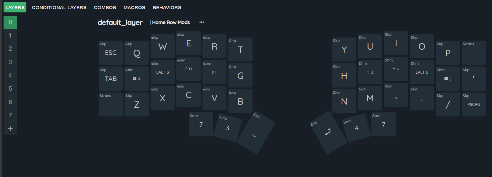
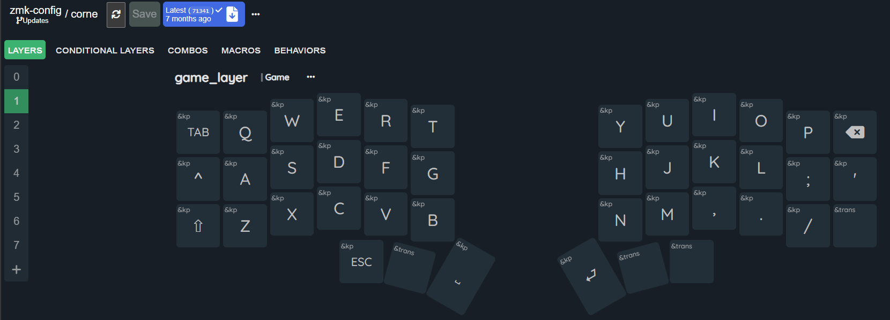
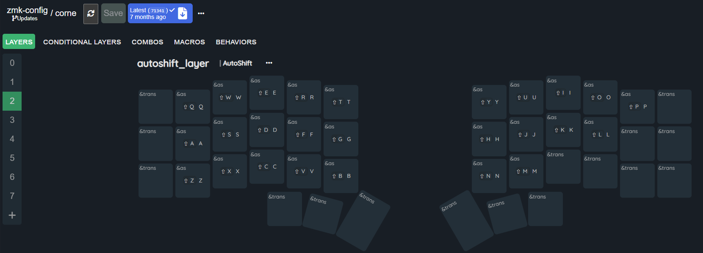
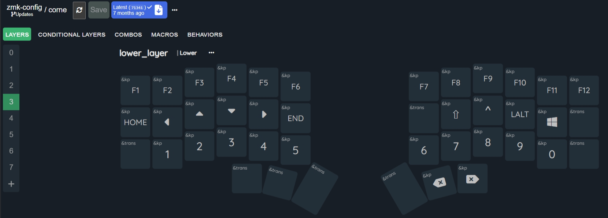
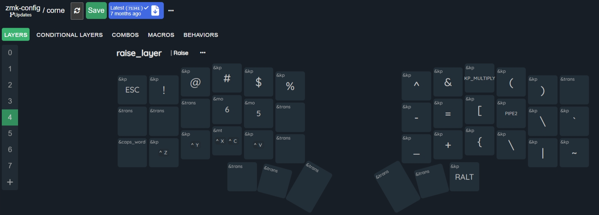
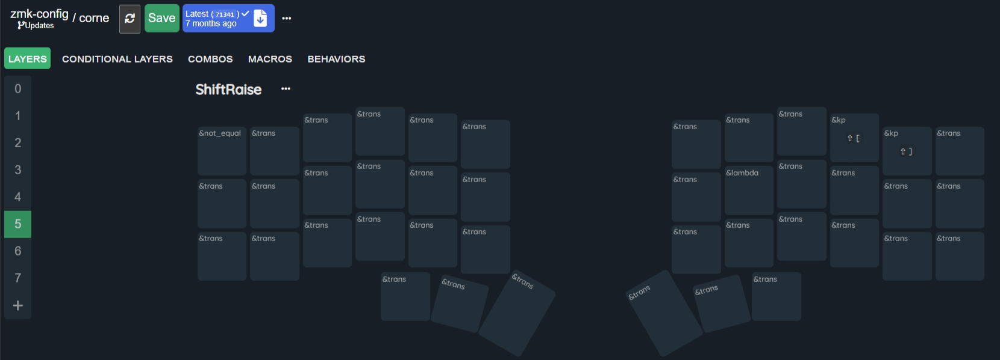
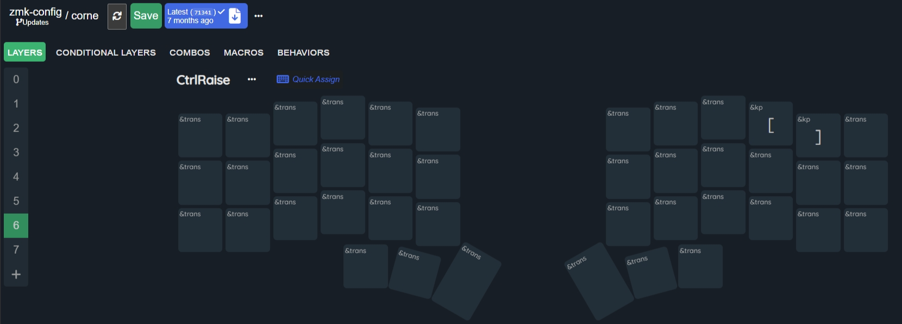
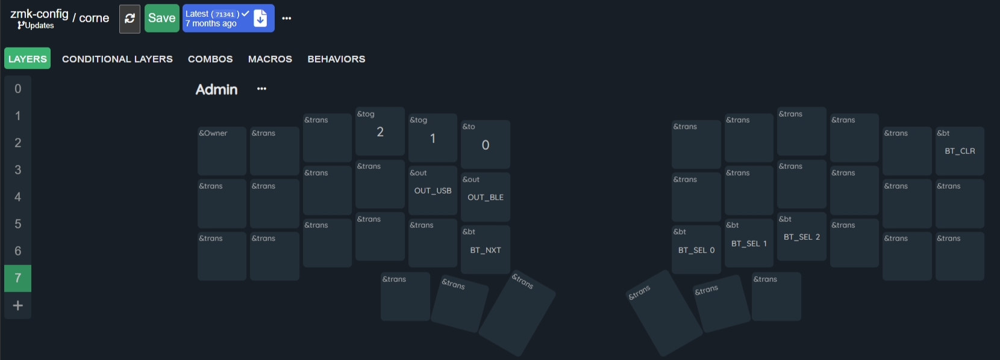

# zmk-config
My slowly evolving keyboard layout
- Home row mods on by default but with a layer without
- Lower for 
    - numerics bottom row
    - Fn keys top row
    - Left hand home row cursors
- Raise for symbols

